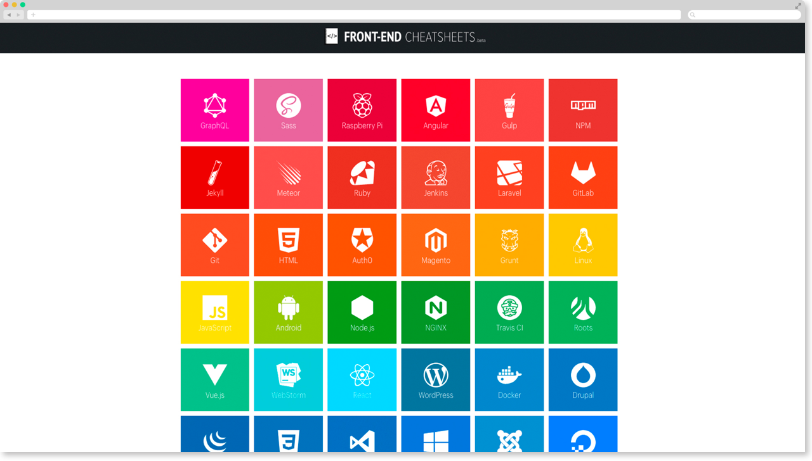

# 

[](https://travis-ci.org/whoisjorge/front-end "See test builds")

> Una colección de apuntes — _cheatsheets & snippets_ — sobre lenguajes de programación, tecnologías, herramientas y recursos relacionados con desarrollo web front-end.

## Instalación

Este sitio está desarrollado con [Jekyll] y alojado en [GitHub Pages]. Para iniciar una versión local del repositorio y que todo funcione correctamente, es necesario instalar las siguientes **dependencias**:

- **[Ruby]** >= 2.2.5
  - [Jekyll] :  _`gem install jekyll`_
  - [Bundler] : _`gem install bundler`_

## Desarrollo

Una vez instaladas las dependencias, configurar el entorno de desarrollo es muy sencillo. En primer lugar clona este repositorio donde quieras y sitúate en el directorio raíz:

```sh
git clone git@github.com:whoisjorge/front-end.git
cd front-end
```

Ahora tan sólo ejecuta el comando _**`bundle install`**_ para instalar las gemas de este proyecto (están especificadas en el archivo [Gemfile](Gemfile)). Si escribes, por ejemplo, el comando _`bundle exec jekyll serve`_ iniciarás un servidor local accesible a través de `http://localhost:4000`

👌

### Workflow

1. [Node.js] — y [npm]
2. [Gulp]

- Para actualizar _npm_ a la última version `npm install npm@latest -g`
- `$ npm install -g gulp`

🚀 Ahora tienes disponible algunos **`comandos`** útiles:

- `npm start`
- `npm run dev`
- `npm run clean`
- { ... }

## Organización de archivos

👻 ...

## Contribuciones

Si encuentras algún bug o quieres contribuir al código puedes hacerlo enviando cualquier cosa desde [aquí](https://github.com/whoisjorge/front-end/issues). Si estás on 🔥 sácate ese [PR](https://github.com/whoisjorge/front-end/pulls) directamente, always welcome! Para enviar contenido recuerda que está escrito en [Markdown] 😶

## Licencia

Tanto el código fuente de este repositorio como el contenido del sitio es de libre utilización y/o modificación según los términos de la [licencia](LICENSE):

- Snippets de código fuente con licencia Open Source [MIT]
- Contenido de los textos así como algunas imágenes [CC BY 4.0]

**Nota:** _En caso de que algún material se encuentre bajo otro tipo de licencia, se adjuntará la licencia correspondiente o una referencia a la misma._

<!-- Thanks for watching! -->
<br>
<p align="center"> <sub><sup>&lt;/&gt;</sub></sup><br>
  <sub><sup><a href="https://www.whoisjorge.me">@whoisjorge</a></sup></sub>
</p>

<!-- Link ref. -->
[MIT]: https://opensource.org/licenses/MIT
[CC BY 4.0]: https://creativecommons.org/licenses/by/4.0/deed.es_ES
[GitHub Pages]: https://pages.github.com/
[Ruby]: https://www.ruby-lang.org
[Jekyll]: http://jekyllrb.com
[Bundler]: https://bundler.io/
[Markdown]: https://guides.github.com/features/mastering-markdown/
[Node.js]: https://nodejs.org
[npm]: https://www.npmjs.com
[Gulp]: http://gulpjs.com
[.JSON]: http://www.json.org/


[Simple Icons]: https://github.com/simple-icons/simple-icons
[Spectre.css]: https://picturepan2.github.io/spectre/
[JS.org]: https://js.org